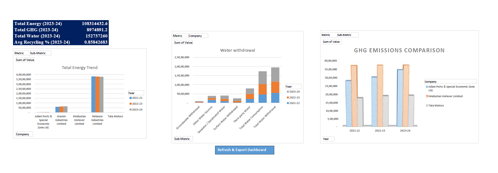
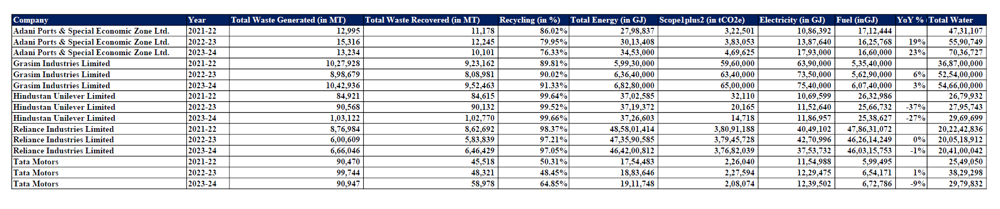

# 🌱 Corporate Sustainability Analytics Dashboard

An advanced Excel-based ESG analytics dashboard built using sustainability data from major Indian companies. This project transforms raw environmental data into actionable insights using KPIs, charts, and automation.

---

## 📊 Project Overview

This dashboard analyzes environmental sustainability performance under **BRSR (Business Responsibility and Sustainability Reporting)** guidelines.

It answers key business questions such as:

* Which company consumes the most energy and water?
* Which company has the highest emissions?
* How has sustainability performance changed over time?
* How efficiently are companies managing waste?

---

## 🖼️ Dashboard Preview

### 📌 Main Dashboard



### 📌 Summary Sheet



---

## 🎯 Objectives

* Consolidate ESG data from multiple companies
* Convert raw data into meaningful KPIs
* Track trends in energy, water, emissions, and waste
* Enable interactive comparison using slicers
* Demonstrate advanced Excel capabilities

---

## 📂 Data Structure

The project uses a structured master table:

| Column     | Description               |
| ---------- | ------------------------- |
| Company    | Company name              |
| Year       | FY 2021–22 to FY 2023–24  |
| Metric     | Energy, Water, GHG, Waste |
| Sub-Metric | Detailed indicator        |
| Unit       | Measurement unit          |
| Value      | Numerical value           |

---

## 📈 Key Metrics

### 🔹 Energy

* Total Energy Consumption
* Electricity & Fuel Usage

### 🔹 Water

* Water Withdrawal
* Water Consumption

### 🔹 Emissions

* Scope 1 Emissions
* Scope 2 Emissions
* Total GHG Emissions

### 🔹 Waste

* Waste Generated
* Waste Recovered
* Waste Disposed

---

## 📊 Dashboard Components

### 🔹 KPI Cards

* Total Energy: **108M+ GJ**
* Total GHG: **8.97M tCO₂e**
* Total Water: **152M+ kL**
* Avg Recycling Rate: **85.84%**

### 🔹 Charts

* Energy Trend (Line Chart)
* Water Trend (Line Chart)
* GHG Emissions (Column Chart)
* Waste Breakdown (Stacked Bar Chart)

### 🔹 Interactivity

* Slicers: Company, Year, Metric
* Dynamic filtering across dashboard

---

## ⚙️ Methodology

1. **Data Collection**

   * Extracted ESG data from company sustainability reports

2. **Data Cleaning**

   * Removed inconsistencies
   * Standardized units
   * Converted values into numeric format

3. **Data Structuring**

   * Created master table for analysis

4. **Analysis**

   * Built Pivot Tables & Charts

5. **Automation**

   * Implemented VBA macro for refresh

---

## 🔁 Automation (Macro)

```vba
Sub RefreshDashboard()
    ThisWorkbook.RefreshAll
End Sub
```

---

## 📊 Key Insights

* Energy and water consumption increased over time
* Some companies reduced emissions despite growth
* Recycling efficiency is high (~86%)
* Significant variation in emissions across companies

---

## ⚠️ Challenges

* Different reporting formats across companies
* Missing and inconsistent data
* Unit standardization issues

---

## 🚧 Limitations

* Only environmental (E) metrics included
* Limited to 3 years of data
* No intensity metrics (e.g., emissions per revenue)

---

## 🚀 Future Improvements

* Power BI dashboard version
* Add Scope 3 emissions
* Include financial & intensity metrics
* Automate data extraction

---

## 🛠️ Tools Used

* Microsoft Excel
* Pivot Tables
* Pivot Charts
* Slicers
* VBA Macros

---

## 📂 Data Source

* dataset / esg-dashboard-india.xlsm

---

## 💼 Skills Demonstrated

* Data Cleaning & Structuring
* ESG & Sustainability Analysis
* Dashboard Development
* Business Intelligence
* Excel Automation

---

## 📌 Author

**Pranav Mathur**
